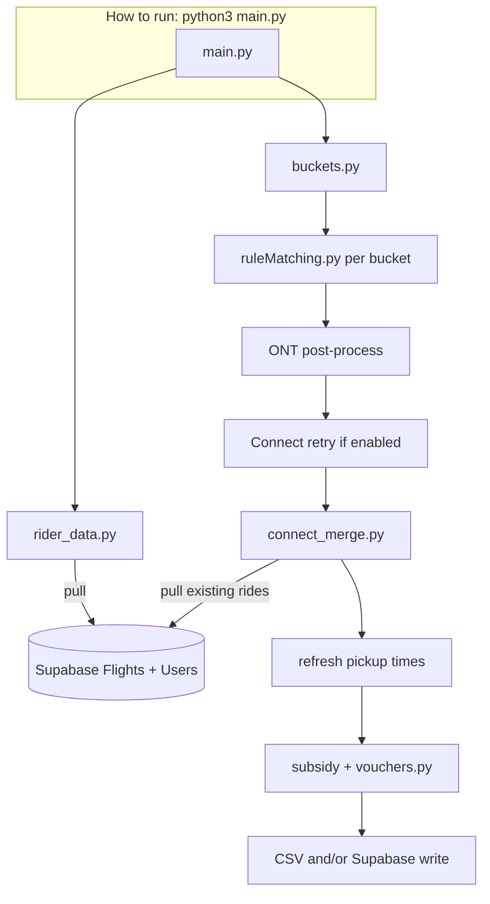

# Pickup Matching Pipeline

Ride-matching for Pickup: reads unmatched flight forms from Supabase, groups riders, applies subsidy and vouchers, and writes results to CSV (dry-run) or Supabase (production).

**Entry point:** `Algorithm/main.py`

---

## Contents

| Section | What it covers |
|--------|----------------|
| [**How to run**](#how-to-run) | Setup, `.env`, commands, CLI flags, output files |
| [**Pipeline overview**](#pipeline-overview) | Run order, interactive diagram, module map |
| [**Matching reference**](#matching-reference) | Buckets, scoring, Connect, subsidy, vouchers, config |

---

# How to run

> **This section is operational** — use it when you need to install dependencies, run a dry-run, or ship a production match.

## Setup

From the project root:

```bash
python3 -m venv .venv
source .venv/bin/activate   # Windows: .venv\Scripts\activate
pip install -r requirements.txt
```

Create `.env` in the project root (or ensure it is loaded when you run from `Algorithm/`):

```bash
SUPABASE_URL=your_supabase_url
SUPABASE_SECRET_KEY=your_service_role_or_secret_key
```

Dependencies (see `requirements.txt`): `pandas`, `python-dotenv`, `supabase`.

## Commands

Paths below assume you **`cd Algorithm`** first (defaults like `../vouchers/` are relative to that folder).

| Goal | Command |
|------|---------|
| **Dry-run** (no DB writes; CSV + voucher `.dryrun` copy) | `python3 main.py --dry-run --days-ahead 20 --vouchers ../vouchers/Summer.csv` |
| **Production** (writes Rides, Matches, updates Flights) | `python3 main.py --vouchers ../vouchers/Summer.csv` |
| **Open pipeline diagram** | `open ../documentation/pipeline_diagram.html` (macOS) |

### Dry-run vs production

| | Dry-run (`--dry-run`) | Production (no flag) |
|--|------------------------|----------------------|
| Supabase reads | Yes (live Flights/Users) | Yes |
| Writes Rides / Matches | No | Yes |
| Updates `Flights.matched` | No | Yes |
| Voucher CSV | Uses `*.dryrun.csv` copy | Updates local CSV or Storage (see `USE_SUPABASE_STORAGE`) |
| `AlgorithmStatus` | Skipped | Updated |
| CSV outputs | Yes | Yes (same writer runs before DB write) |

## CLI flags

| Flag | Default | Description |
|------|---------|-------------|
| `--dry-run` | off | Do not write matches to Supabase |
| `--csv PATH` | `../matches/matches_dryrun.csv` | Matched-groups CSV path |
| `--days-ahead N` | `10` | Inclusive end: flights on or before today + N days |
| `--days-ahead-start N` | *(omit)* | Inclusive start: flights on or after today + N. Omit = legacy rule (date strictly after today). Use `0` to include today |
| `--vouchers PATH` | `../vouchers/Thanksgiving.csv` | Voucher pool CSV |

Examples:

```bash
# Wider date window, custom CSV name
python3 main.py --dry-run --days-ahead-start 0 --days-ahead 30 \
  --csv ../matches/spring_check.csv --vouchers ../vouchers/Summer.csv

# Production with explicit voucher file
python3 main.py --days-ahead 14 --vouchers ../vouchers/Summer.csv
```

`--days-ahead-start` must be ≤ `--days-ahead`.

## Output files

Written under `matches/` and `vouchers/` (paths relative to `Algorithm/`):

| File | Contents |
|------|----------|
| `../matches/matches_dryrun.csv` | Matched groups: bucket, times, riders, vouchers, subsidy, Uber type |
| `../matches/unmatched_reasons_dryrun.csv` | Unmatched riders + best reason from `audit.py` |
| `../vouchers/<name>.dryrun.csv` | Voucher working copy during dry-run (real pool not consumed) |

---

# Pipeline overview

> **This section describes behavior** — what runs, in what order, and which files participate. For day-to-day execution, use [How to run](#how-to-run) above.

## Visual diagram

Interactive flow (pull / push / next-step arrows):

**[documentation/pipeline_diagram.html](documentation/pipeline_diagram.html)**

Open in a browser after cloning; no server required.

## Run order (high level)



1. **Start** — Load `.env`, `config.py`, create Supabase client.
2. **Load riders** — `rider_data.fetch_riders()`: flights where `matched` is not `true` (NULL or false), plus `Users` for school/name.
3. **Bucket** — `buckets.make_buckets()` by direction, airport, and `COMPATIBLE_SCHOOLS`.
4. **Match** — `ruleMatching.match_bucket()` per bucket (`audit.py`, `connect_policy.py` assist).
5. **ONT post-process** — `_ont_post_process_unmatched()` (4+2 → 3+2 when possible).
6. **Connect retry** — `_final_lax_unmatched_retry()` when Connect is enabled in config.
7. **Connect merge** — `connect_merge.merge_connect_with_existing()`: this run + unmatched + **existing DB rides** → large Connect groups.
8. **Pickup times** — `refresh_match_suggested_times()` (15 min before/after overlap rules).
9. **Subsidy & vouchers** — `apply_group_subsidy()` then `assign_vouchers()`.
10. **Output** — CSV always; Supabase writes + `algorithmStatus` in production.

Connect merge and ONT post-processing run **inside** `main.py` — you do not need a separate script for the standard pipeline.

## Module map

| File | Role |
|------|------|
| `main.py` | CLI, orchestration, subsidy, CSV/DB writes |
| `rider_data.py` | Supabase → `RiderLite` list |
| `buckets.py` | Bucket keys (`TO LAX \| POMONA`, etc.) |
| `ruleMatching.py` | Core matcher, suggested times, ONT post-process |
| `audit.py` | Unmatched reasons for CSV |
| `connect_policy.py` | Reads `CONNECT_*` from config; gates Connect steps |
| `connect_merge.py` | Post-match Connect merge across DB + current run |
| `config.py` | Bags, overlap, Connect airports/sizes, covered dates, storage |
| `vouchers.py` | Voucher pool assignment |
| `storage.py` | Supabase Storage helpers when `USE_SUPABASE_STORAGE` is true |
| `algorithmStatus.py` | Production run tracking |

---

# Matching reference

> **Deep detail** — bucketing rules, scoring, Connect, subsidy, and voucher policy. Change behavior in `Algorithm/config.py`.

## Data loaded from Supabase

**Flights** (unmatched only): `matched` is skipped when `true`; NULL and `false` are included.

Selected fields include `flight_id`, `user_id`, times, `airport`, `date`, `to_airport`, `terminal`, bags, etc.

**Users:** `user_id`, `school`, `firstname`, `lastname`. Flights without a school are skipped.

Date window: `--days-ahead` and optional `--days-ahead-start`.

## Bucketing

Bucket keys look like `TO LAX | POMONA` or `FROM ONT | ALL`.

- **Direction:** `TO` = `to_airport` true (school → airport), `FROM` = airport → school.
- **School:** From `COMPATIBLE_SCHOOLS` in `config.py` (currently Pomona only matches Pomona).

## Core matching (`ruleMatching.py`)

Per bucket:

1. In-bucket Connect attempt when policy allows (overlap-based; bags ignored for Connect sizing).
2. Sort riders by shortest window first.
3. Score pairs, pick non-overlapping pairs, expand to up to `MAX_GROUP_SIZE`.
4. Leftover passes (`SPLIT_4_TO_3_2`, `ABSORB_LEFTOVERS`, LAX/ONT optimizations, etc.).

**Validity (normal groups):** 2–`MAX_GROUP_SIZE` riders, overlap/touch rules, bag limits, terminal rules per `TERMINAL_MODE`.

**Suggested time:** TO airport = 15 min before overlap end; FROM airport = 15 min after overlap start (refreshed again after Connect merge).

Key config defaults:

```python
MAX_TOTAL_BAGS = 10
MAX_GROUP_SIZE = 5
TERMINAL_MODE = "slack"
SAME_FLIGHT_PRIORITY = True
```

## Connect shuttles

Controlled in `config.py` (see `connect_policy.py`):

```python
CONNECT_DEPARTURE = ["LAX", "ONT"]   # school → airport; [] disables outbound Connect
CONNECT_ARRIVAL = ["LAX", "ONT"]     # airport → school; [] disables inbound Connect
CONNECT_SIZE1 = [6, 12]
CONNECT_SIZE2 = [12, 24]             # preferred tier when possible
```

- Empty `CONNECT_DEPARTURE` and `CONNECT_ARRIVAL` → Connect off.
- In-bucket formation + post-run **merge** with existing Supabase rides (`connect_merge.py`).
- Connect groups: `ride_type = "Connect"`, no vouchers.

## Post-processing in `main.py`

| Step | What it does |
|------|----------------|
| `_ont_post_process_unmatched` | Pair unmatched ONT riders with groups of 4 → 3+2 split when valid |
| `_final_lax_unmatched_retry` | Re-bucket and match Connect-scoped unmatched (e.g. new 3-person groups) |
| `merge_connect_with_existing` | Merge small groups + unmatched + **existing DB** into Connect tiers |

## Subsidy

Applied after final group list is known (`main.py`):

```python
thresholds = {"LAX": 3, "ONT": 2}
```

Qualifies when: threshold met, all riders Pomona, date in `COVERED_DATES_OUTBOUND` / `COVERED_DATES_INBOUND` (when `COVERED_DATES_EXPLICIT` is true).

## Vouchers (`vouchers.py`)

After subsidy; expects CSV columns such as `Date (start)`, `Date (end)`, `Contingency`, `voucher_link`, `TO_AIRPORT`, `AIRPORT`, `USED`.

- No vouchers on Connect shuttles.
- Group vouchers: subsidized + covered groups only.
- Contingency: inbound subsidized covered groups.
- Boolean `USED` is parsed safely (string `"False"` is not treated as used).

Storage mode: set `USE_SUPABASE_STORAGE = True` in `config.py` to use Supabase Storage for the active voucher file instead of only local CSV.

## Repository layout

```text
ML/
├── Algorithm/          # All Python pipeline code
├── documentation/      # pipeline_diagram.html, legal/SBOM docs
├── matches/            # CSV outputs (dry-run)
├── vouchers/           # Voucher pools (*.csv)
├── requirements.txt
├── .env                # Not committed; Supabase credentials
└── README.md
```

## Docker

`Dockerfile` is present for containerized runs; use the same CLI from the image working directory that contains `Algorithm/main.py` and mount `.env` / voucher paths as needed.
